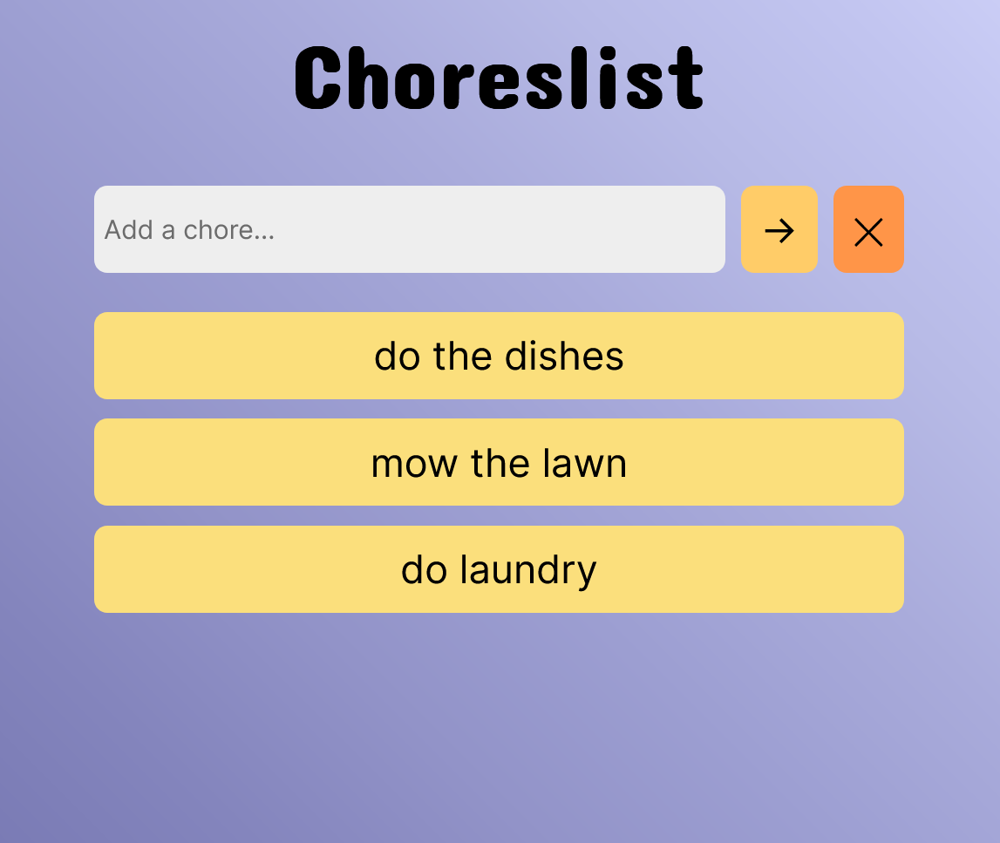

# Choreslist Solo Project - Scrimba Bootcamp

This is my solution to the Scrimba Choreslist (ToDo list) project, part of the Scrimba Frontend Developer Bootcamp.

## Table of contents

- [Overview](#overview)
  - [Requirements](#requirements)
  - [Strech goals](#stretch-goals)
  - [Screenshot](#screenshot)
  - [Links](#links)
- [My Process](#my-process)
  - [Built with](#built-with)
- [Author](#author)

## Overview

### Requirements

- Build page from scratch
- Follow provided design spec
- Prevent empty chore from being added
- Use localStorage to allow for chore persistance

### Strech goals

- Prevent adding duplicate chore
- Click individual chore to remove from list
- Show random GIF when all chores are completed

### Screenshot

### Links

- [Scrimba solution URL](https://scrimba.com/scrim/co9774bdb8012c88db66f65fd)
- [live site URL](https://celadon-puffpuff-3dc6bb.netlify.app/)

## My process

### Built with

- Semantic HTML5 markup
- CSS custom properties
- Flexbox
- JavaScript

## Author

- Frontend Mentor - [@MattPahuta](https://www.frontendmentor.io/profile/MattPahuta)
- Twitter - [@MattPahuta](https://twitter.com/MattPahuta)